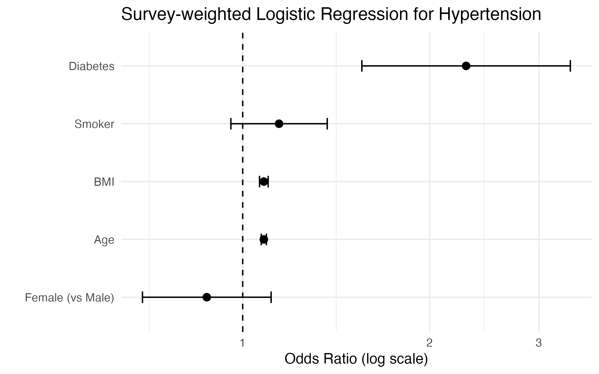

# NHANES 2011–2012 Survey-Weighted Hypertension Risk Analysis

## Motivation

Hypertension remains one of the leading modifiable risk factors for cardiovascular disease in the United States. Using nationally representative NHANES data, this project evaluates independent risk factors associated with hypertension under a complex survey sampling design.

---

## Study Population

- Data source: NHANES 2011–2012 (CDC)
- Initial adult sample (age ≥ 20): **5,319 participants**
- Final analytic sample after exclusions: **4,988 participants**
- Survey design: Stratified, multi-stage cluster sampling
- Sampling weights: `WTMEC2YR`

Hypertension defined as:
- SBP ≥ 140 mmHg, OR
- DBP ≥ 90 mmHg, OR
- Current use of antihypertensive medication

---

## Methods

### Data Engineering
- Python (`pandas`, `SQLAlchemy`) used to ingest NHANES XPT files
- MySQL used to construct analytic dataset
- Data quality checks: missingness, range validation, duplicate checks
- Exported cleaned dataset for statistical modeling

### Statistical Analysis
- R (`survey` package)
- Survey-weighted logistic regression
- Outcome: Hypertension (binary)
- Covariates:
  - BMI
  - Age
  - Sex
  - Smoking status
  - Diabetes status

---

## Key Findings

After adjusting for covariates:

- **Diabetes** was strongly associated with hypertension  
  (OR 2.29, 95% CI 1.56–3.37)  
  → Diabetic individuals had approximately **2.3× higher odds** of hypertension.

- **BMI** and **age** were independently associated with increased odds  
  (OR ≈ 1.08 per unit increase).

- Sex and smoking were not statistically significant after adjustment.

These findings align with established epidemiologic evidence and demonstrate proper application of survey-weighted inference.

---

## Visualization

A publication-style forest plot was generated to display adjusted odds ratios:



---

## Project Structure
```
nhanes_sql/
├── data.py                        # Python ETL + SQL pipeline
├── Nhanes_personal_project.Rmd    # Analysis report (R Markdown)
├── Nhanes_personal_project.pdf    # Compiled report
└── output/
    ├── analysis_dataset.csv       # Cleaned analysis dataset
    ├── qc_summary.csv             # Quality control summary
    ├── forest_plot_htn.png        # Forest plot (hypertension)
    └── regression_table.png       # Regression results table
```

---

## Reproducibility

- Python for data construction
- R for survey-weighted modeling
- Fully reproducible workflow from raw NHANES(2011-2012) files

---

## Skills Demonstrated

- SQL data construction
- Python ETL pipeline
- Complex survey analysis
- Logistic regression modeling
- Clinical result interpretation
- Publication-quality visualization
